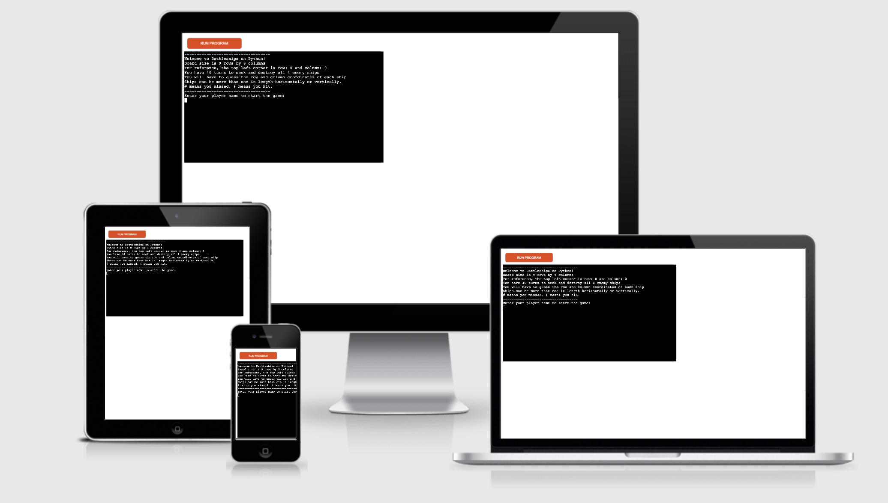
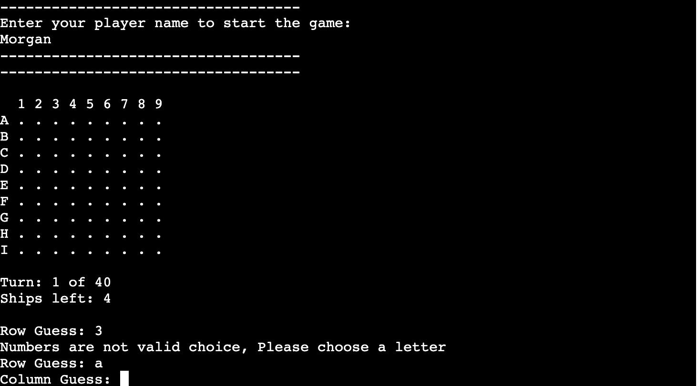
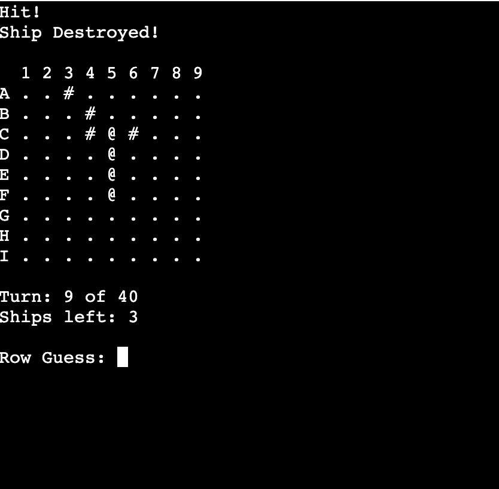
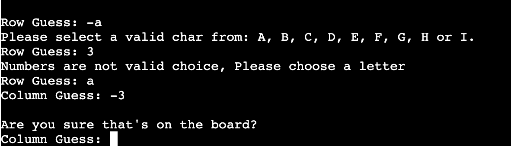

# MM's Battleship
This is a terminal based Python made 'Battleship' game where you play to seek and destroy the computers ships.

[View the live project here](https://mm-battleship.herokuapp.com/)

## Table of contents
1. [How To Play](#How-To-Play)
2. [Features](#Features)
    1. [Existing Features](#Existing-Features)
    2. [Features to Implement in the future](#Features-to-Implement-in-the-future)
3. [Data Model](#Data-Model)
4. [Testing](#Testing)
5. [Issues and Bugs](#Issues-and-Bugs)
6. [Deployment](#Deployment)
7. [Credits](#Credits)
8. [Acknowledgements](#Acknowledgements)
***

## How to Play

**Battleship** is a  [strategy](https://en.wikipedia.org/wiki/Strategy "Strategy")  type  [guessing game](https://en.wikipedia.org/wiki/Guessing_game "Guessing game")  for two players. It is played on ruled grids (paper or board) on which each player's fleet of ships (including battleships) are marked. The locations of the fleets are concealed from the other player. Players alternate turns calling "shots" at the other player's ships, and the objective of the game is to destroy the opposing player's fleet.

**Battleship**  dates from  [World War I](https://en.wikipedia.org/wiki/World_War_I "World War I"). It was published by various companies as a pad-and-pencil game in the 1930s, and was released as a plastic  [board game](https://en.wikipedia.org/wiki/Board_game "Board game")  by  [Milton Bradley](https://en.wikipedia.org/wiki/Milton_Bradley_Company "Milton Bradley Company")  in 1967. The game has spawned electronic versions, video games, smart device apps and a  [film](https://en.wikipedia.org/wiki/Battleship_(film) "Battleship (film)").

In this Python version, you are playing to seek and destroy the computers ships. It is a one player game where you have 40 turns/chances to find out where all 4 enemy ships are located on the board.

The main requirements for this project were to make a logic game which a working battleships game for a single user to play against the computer using primarily **Python**

[Back to top ⇧](#MM's-Battleship)

## Features

### Existing Features
- **Random Board generation** randomly generates a new board each time the game is launched  
- The player **cannot see** where the computers ships are located
- Accept **user input**
- **Maintain number of ships** remaining to destroy
 
- **Multi-cell ships** randomly generates ships that occupy more than 1 cell
- **Horizontal** & **Vertical** ship layouts that are randomly generated

- **Input validation** and **error checking** 
	- Rows accept letters & columns accept numbers
	- Notify user if value in Row is either inaccurate value or if not on the board
	- Notify if value in Column is off the board or not a number
	- Cannot input the same answer twice

### Features to Implement in the future
- **Allow** user to modify grid size and number of ships on the board
- **Create** a player board and let **player** choose where to put his ships

[Back to top ⇧](#MM's-Battleship)

## Data Model
I decided to create a Board class as my model. The game creates an instance of a 9 by 9 grid which contains 4 enemy ships that are hidden to the player that span between 2 and 5 in length and that can be horizontal or vertical.

The Board class stores the size of the board, the direction (horizontal/vertical) of the ships and their location on the board. The class also contains methods that validates if a ship is already in an existing coordinate as well as a method that assigns a ships coordinate and another method checks if a ship has already been destroyed by the user.

There are also pre-defined variables that set up the amount of enemy ships to destroy, sets their minimum/maximum length and prints out the default board to the interface through `board_display`.

[Back to top ⇧](#MM's-Battleship)

## Testing

I have manually tested this project by doing the following:
- Passed the code through PEP8 and confirmed there are no problems.
- I have tried invalid inputs for rows and columns such as negative values and letters for numbers and vice-versa 
- Played the games 40 turns in a win state and lose state to ensure outcomes were working
- Tested in my personal and Heroku terminals

[Back to top ⇧](#MM's-Battleship)

## Issues and Bugs
### Solved Bugs
- I wanted to return letters as rows and numbers as columns. In order to do so I had to learn about ASCII, chr() and ord() for the `user_get_row` function as well as the `print_board`
- Validating the user choice was a challenge as I was not able to return a specific message for an error according to the type of error. For example if the user input a negative letter, a letter off the board or a number, the error was the same. Additionally, there was an issue where if I entered a number instead of a letter, the system would return that the value was not on the board versus it not being inaccurate. In order to go around this I had to create another method`validate_user_row_choice` to help validate the type of data that the user input as a row.
- Faced indentation issues when it came to the `temp`variable which would return an error stating that the variable was not defined. Took me a while to figure out that `del temp`was within the `while loop`

### Remaining Bugs
- No bugs remaining to my knowledge.

### Validator Testing
- I ran the PEP8 validator which spotted a few typos which I was able to fix.

[Back to top ⇧](#MM's-Battleship)

## Deployment
This project was developed using [Gitpod](https://gitpod.io/ "Link to GitPod site"), committed to git and pushed to GitHub using their browser terminal as well as [Heroku](https://www.heroku.com/ "Link to Heroku site") where the app is hosted & deployed

### Deploying on Heroku
To deploy this page to Heroku from its GitHub repository, the following steps were taken:

1. Log into [Heroku](https://www.heroku.com/ "Link to Heroku site")
2. Go to settings and add the `Python` and `Nodejs` buildpacks in that order
3. Go to Deploy and select Github as the deployment method
4. Connect the app to the git hub repository 
5. Click on **Deploy**

[Back to top ⇧](#MM's-Battleship)

## Credits 
- Code Institute for the deployment terminal
- Wikipedia for the details of the battleship game
- [CodeAcademy](https://www.codecademy.com/catalog/language/python) for their lessons on Python and the battleship game
- User cloud2236863496 on CodeAcademy forums who gave me the idea for horizontal & vertical display of ships

[Back to top ⇧](#MM's-Battleship)
## Acknowledgements

- I would like to thank my mentor Antonio for their valuable feedback and critic during the process of development
- I would like to thank my cousin David who is a solutions architect who helped me troubleshoot my code.

[Back to top ⇧](#MM's-Battleship)